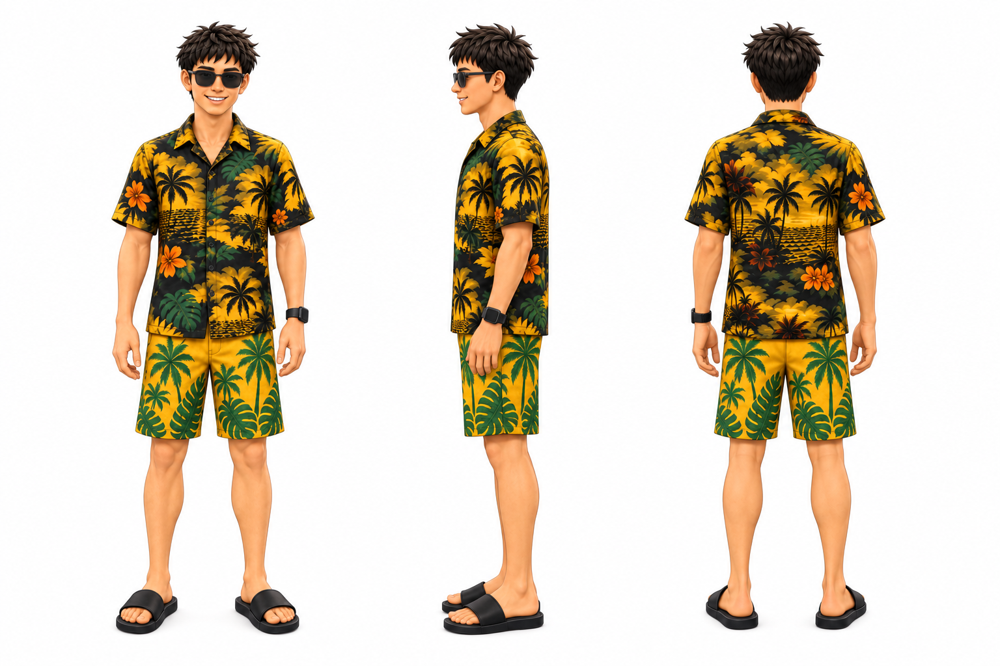
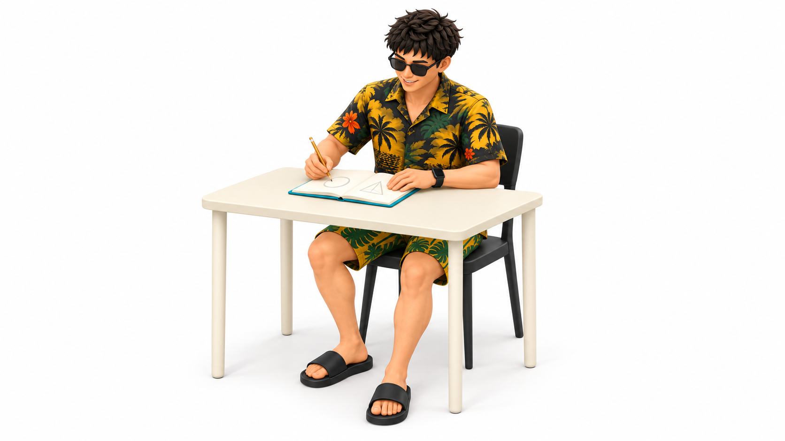
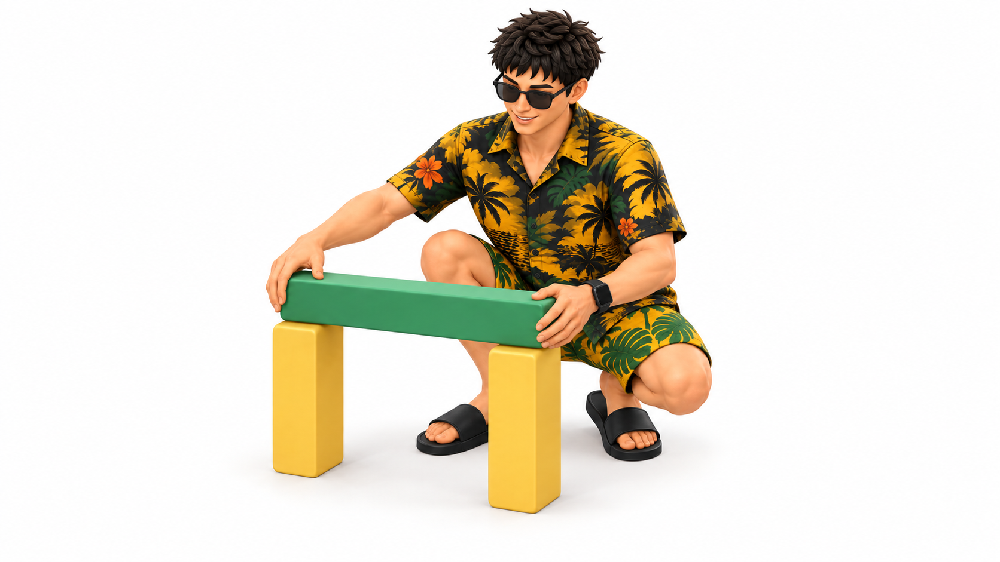
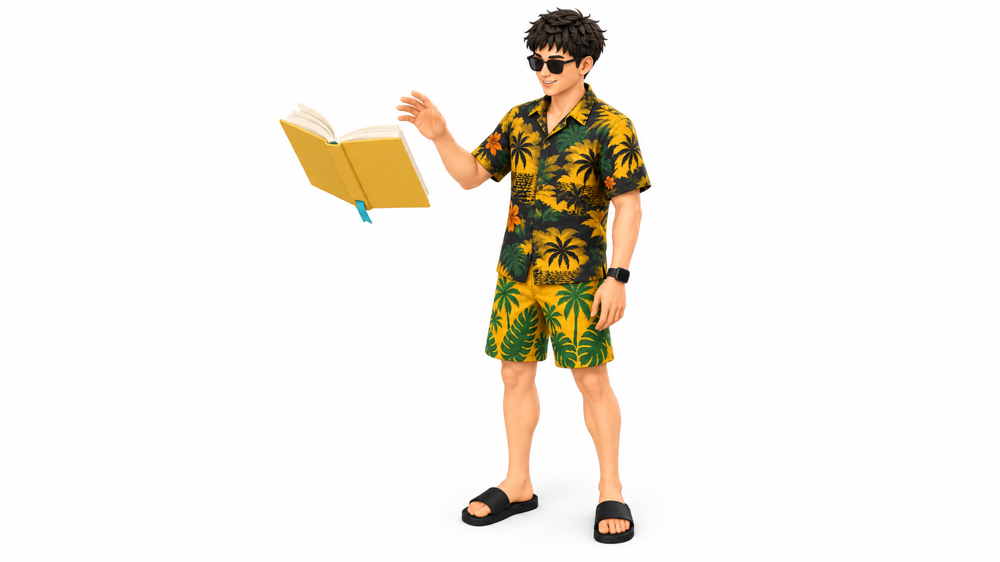

# 金尘马 (Jinchenma) IP Skills

[中文文档](README.md)

Use one consistent, reusable character IP for recognizable article illustrations. Soft dimensional 3D is the default; the original 2D surrealist style is preserved and available on explicit request.

This repository contains two Agent Skills that work independently or together. You can illustrate an article immediately with the bundled 金尘马 character, or create your own character from a portrait and make it the recurring figure in your articles.

## Examples

### Character IP Builder

`jinchenma-ip-builder` turns a character into a consistent front, side, and back turnaround that provides a stable reference for future generations.



### Article Illustrations

`jinchenma-ip-article-illustrations` defaults to soft dimensional forms, matte materials, white space, and a restrained palette.







### Preserved Legacy 2D Examples

These original assets and rules remain available on explicit request.

<table>
  <tr>
    <td width="50%"></td>
    <td width="50%"></td>
  </tr>
  <tr>
    <td width="50%"></td>
    <td width="50%"></td>
  </tr>
</table>

## Approved Visual Direction and Process Records

The [3D visual and palette candidate v1](docs/visual-directions/20261001-3d-v1/README.md) includes character images, a turnaround, a scene study, a standalone palette, and a [browser preview](docs/visual-directions/20261001-3d-v1/preview.html). These dimensional 2D PNG illustrations have been approved and promoted to the default character and style. The process records remain available.

The [editorial illustration style samples v1](docs/visual-directions/20261001-illustration-style-v1/README.md) test visual consistency across three scenes. Compare them in the [sample preview](docs/visual-directions/20261001-illustration-style-v1/preview.html).

## Two Ways to Use the Skills

### Start with 金尘马

```text
Install the Skills → Provide an article → Generate illustrations with the bundled 金尘马 character
```

No character setup is required.

### Use Your Own Character IP

```text
Provide a portrait or turnaround → Create a character IP → Import the character → Illustrate an article
```

Your character can be reused across articles or switched at any time. Switching characters changes the identity only; it does not change how the article is analyzed or how the illustrations are styled.

## Included Skills

| Skill | Purpose |
| --- | --- |
| [`jinchenma-ip-builder`](skills/jinchenma-ip-builder/SKILL.md) | Creates a consistent, reusable character IP from one clear portrait or an existing character turnaround |
| [`jinchenma-ip-article-illustrations`](skills/jinchenma-ip-article-illustrations/SKILL.md) | Reads the full article, generates illustrations with the current character, and recommends where each image belongs |

## Highlights

- Reads the complete article before deciding what to illustrate and how many images are useful.
- Gives each image one central idea instead of crowding the composition.
- Preserves the character's appearance, clothing, accessories, and signature features.
- Supports both the bundled 金尘马 character and your own character IPs.
- Leaves the source article unchanged by default and never overwrites existing images.
- Defaults to `jinchenma-3d`; `jinchenma-surrealism` requires an explicit choice.
- Keeps character variants and illustration styles separate; each style has its own rules, prompt template, palette when applicable, and examples.
- A previous legacy selection does not carry into a new request that omits the style.

## Installation

Send the following prompt to an AI agent that can access a terminal and the filesystem:

```text
Please install the two Agent Skills in this repository:
https://github.com/jinchenma94/jinchenma-ip-skills

Determine the correct Skills installation location for my current client and complete the installation. Install only the two Skills from the repository. Confirm that both Skills are available when finished.
```

## Quick Start

### Generate Article Illustrations Immediately

```text
Use jinchenma-ip-article-illustrations. Read the complete article and generate the illustrations directly. Leave the source unchanged and tell me where each image belongs:
<article URL or full text>
```

On first use, the Skill asks whether you want to switch to your own character IP. Skip the switch to continue with the bundled 金尘马 character.

### Select the Legacy Style Explicitly

```text
Use jinchenma-ip-article-illustrations with the legacy 2D surrealist style:
<article text>
```

Omitting the style, or requesting 3D, uses the new default. An old IP manifest's `style` field does not select the illustration style. Character variants live under `assets/ip-packs/jinchenma/variants/`; independent style packs live under `assets/style-packs/`. The read-only `scripts/resolve_visuals.py` verifies the selection.

### Create and Use Your Own Character IP

First, provide one clear portrait:

```text
Use jinchenma-ip-builder. Create a 金尘马 character IP from this portrait. Keep the facial features, hairstyle, clothing, and accessories consistent.
```

After the character is ready, run the article illustration Skill:

```text
Use jinchenma-ip-article-illustrations. Import the 金尘马 character I just created, then read this complete article and generate the illustrations directly:
<article URL or full text>
```

## Output

Article illustrations are saved in the current project by default:

```text
.jinchenma-assets/<article-slug>/
```

If no usable project directory is available, they are saved under the user directory:

```text
~/.jinchenma-assets/<article-slug>/
```

The final response briefly describes each image's purpose, file path, and recommended insertion point, for example:

```text
01-attention-trap.png
Purpose: Show attention being continuously pulled by an external mechanism
Suggested placement: After the paragraph beginning “Attention is not entirely autonomous”
```

## Requirements

- The AI agent must support Skills and filesystem access.
- Direct image generation requires an image-capable client or tool.
- When you provide an article URL, the AI agent must be able to access the page. If it cannot, paste the complete article instead.

## Privacy

The public repository contains only the shared workflow, documentation, and bundled 金尘马 character. It does not include user portraits, private character IPs, private articles, or machine-specific paths.

The Builder uses a portrait only as a visual reference for the current task and does not write the source image into the generated character IP. The image is still processed by the AI client or image-generation service you use, whose own privacy policy applies.

## Licensing

- Code, shared workflows, and documentation: [MIT](LICENSE).
- Bundled 金尘马 images and character assets: [CC BY 4.0](LICENSE-ASSETS). When using or adapting them, credit either “金尘马” or “Jinchenma” and indicate any changes.
- Users choose the license for their own private character IPs.

## Feedback

For installation, character consistency, or article illustration issues, open a [GitHub Issue](https://github.com/jinchenma94/jinchenma-ip-skills/issues). Remove private portraits, articles, and character assets before submitting.

## Connect

X: [@jinchenma_ai](https://x.com/jinchenma_ai)
