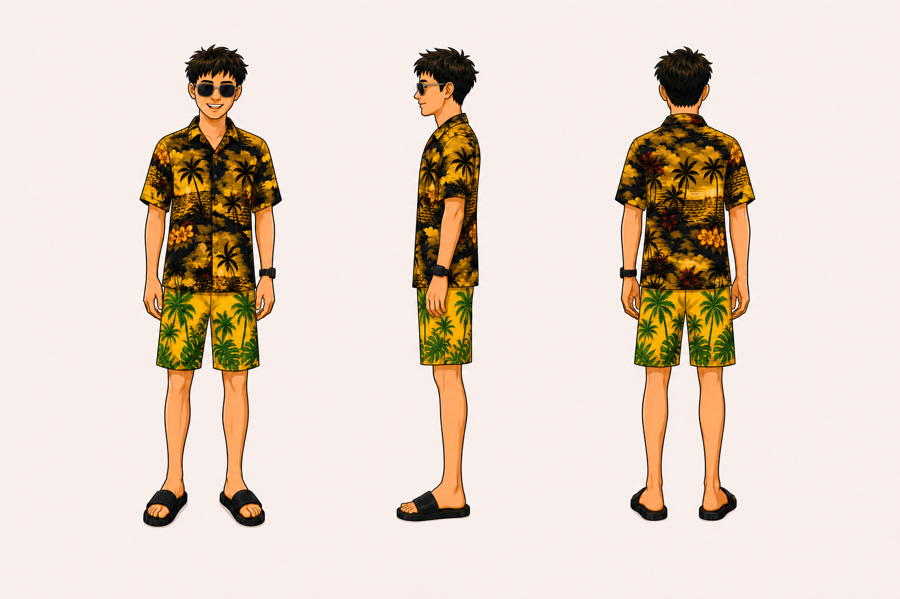
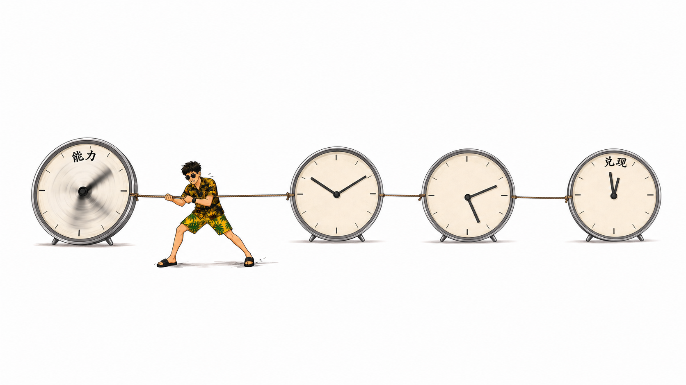
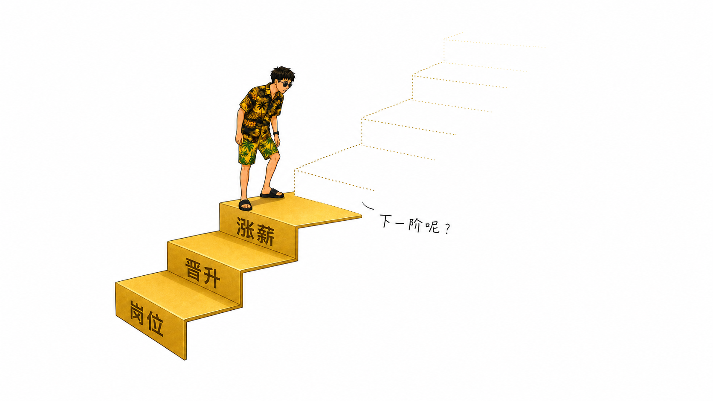
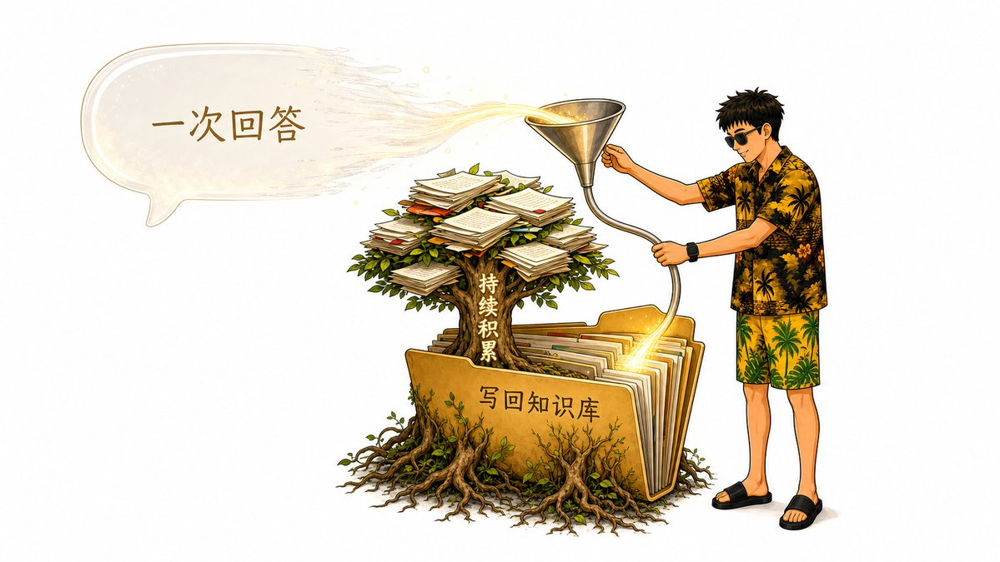

# 金尘马 IP Skills

[English document](README.en.md)

用一个稳定、可复用的人物 IP，为文章持续生成统一、有辨识度的超现实主义插图。

这个仓库包含两个可以独立或配合使用的 Agent Skills：你可以直接使用内置金尘马为文章配图，也可以先从照片创建自己的个人 IP，再让它成为文章中的固定角色。

## 效果展示

### 个人 IP 形象构建效果

`jinchenma-ip-builder` 将人物整理成正面、侧面和背面统一的三视图，为后续持续生成同一角色提供稳定参考。



### 文章插图效果

`jinchenma-ip-article-illustrations` 使用同一个金尘马人物，把文章观点转化为简洁、克制并带有超现实关系的插图。

<table>
  <tr>
    <td width="50%"></td>
    <td width="50%"></td>
  </tr>
  <tr>
    <td width="50%"></td>
    <td width="50%"></td>
  </tr>
</table>

## 两种使用方式

### 直接使用金尘马

```text
安装 Skills → 提供文章 → 使用内置金尘马生成插图
```

不需要提前创建人物，安装后即可开始使用。

### 使用自己的个人 IP

```text
提供照片或已有三视图 → 创建个人 IP → 导入人物 → 为文章生成插图
```

人物可以持续复用，也可以随时切换。更换人物只会改变角色身份，不会改变文章分析方式和插图画风。

## 包含的 Skills

| Skill | 用途 |
| --- | --- |
| [`jinchenma-ip-builder`](skills/jinchenma-ip-builder/SKILL.md) | 从一张清晰人物照片或已有角色三视图创建稳定、可复用的个人 IP |
| [`jinchenma-ip-article-illustrations`](skills/jinchenma-ip-article-illustrations/SKILL.md) | 完整阅读文章，使用当前人物直接生成插图，并给出每张图片的建议插入位置 |

## 核心特点

- 完整阅读文章后再判断需要画什么、画几张。
- 每张图片只表达一个核心观点，避免元素堆砌。
- 保持人物外貌、服装、配件和标志性特征一致。
- 支持内置金尘马和用户自己的个人 IP。
- 默认不修改原文章，也不会覆盖已经生成的图片。
- 所有人物共用 `jinchenma-surrealism` 文章插图画风。

## 安装

把下面整段提示词发送给能够访问终端和文件系统的 AI Agent：

```text
请帮我安装这个仓库中的两个 Agent Skills：
https://github.com/jinchenma94/jinchenma-ip-skills

请根据我当前使用的客户端自行确定正确的 Skills 安装位置并完成安装。只安装仓库中的两个 Skill。安装完成后确认两个 Skill 可以使用。
```

## 快速开始

### 直接为文章生成插图

```text
使用 jinchenma-ip-article-illustrations。请完整读取这篇文章并直接生成配图，不修改原文，告诉我每张图片适合插入在哪里：
<文章地址或正文>
```

第一次使用时，Skill 会询问是否更换为自己的 IP 形象。选择暂不更换即可使用内置金尘马。

### 创建并使用自己的个人 IP

先提供一张清晰人物照片：

```text
使用 jinchenma-ip-builder。请根据这张照片为我创建金尘马个人 IP，保持人物的五官、发型、服装和配件特征一致。
```

创建完成后，再运行文章插图 Skill：

```text
使用 jinchenma-ip-article-illustrations。请导入刚刚创建的金尘马，然后完整读取这篇文章并直接生成配图：
<文章地址或正文>
```

## 生成结果

文章插图默认保存在当前项目的：

```text
.jinchenma-assets/<article-slug>/
```

如果当前没有可用的项目目录，则保存在用户目录下的：

```text
~/.jinchenma-assets/<article-slug>/
```

最终回复会简要说明每张图片的用途、文件路径和建议插入位置，例如：

```text
01-attention-trap.png
用途：表达注意力被外部机制持续牵引
建议位置：放在“注意力并不是完全自主的”这一段之后
```

## 使用要求

- AI Agent 需要支持 Skills 和文件读写。
- 要直接生成图片，当前客户端需要具备图像生成能力。
- 使用文章链接时，AI Agent 需要能够访问网页；无法访问时可以直接粘贴完整正文。

## 隐私

公开仓库只包含通用工作流、文档和内置金尘马人物，不包含用户的原始照片、私人 IP、私人文章或本机路径。

Builder 只把真人照片作为当前任务的视觉参考，不会将原始照片写入生成的个人 IP。照片仍会经过你使用的 AI 客户端或图像生成服务，其数据处理方式以相应服务的隐私政策为准。

## 授权

- 代码、共享工作流和文档：[MIT](LICENSE)。
- 内置金尘马图片与人物资产：[CC BY 4.0](LICENSE-ASSETS)，使用或改编时需要署名为“金尘马”或“Jinchenma”；如有修改，需要注明。
- 用户创建的私人 IP 由用户自行决定授权方式。

## 反馈

遇到安装、人物一致性或文章配图问题，可以通过 [GitHub Issues](https://github.com/jinchenma94/jinchenma-ip-skills/issues) 反馈。提交问题前请移除私人照片、文章和个人 IP 素材。

## 联系与关注

X：[@jinchenma_ai](https://x.com/jinchenma_ai)
